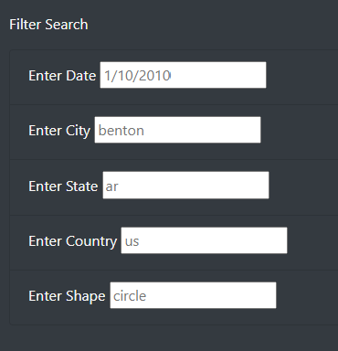
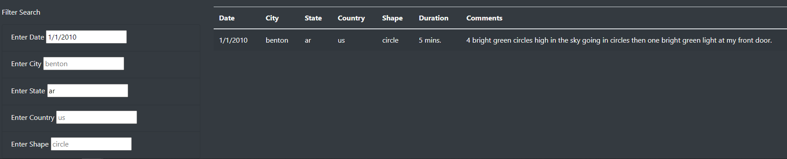

# UFOs

## Overview
The purpose of the UFO Sightings project is to add further filtering abilities to the webpage. This will allow a more in-depth analysis of the UFO sightings.

## Results
The UFO Sightings webpage can easily be used by someone by entering filters. At the bottom left-hand side of the page are five filtering options: date, city, state, country, and shape.  
To search, enter information into any of the filters desired. An important note is to always use all lowercase letters when searching. For example, if someone wanted to search for UFO sightings in Arkansas on January 1st, 2010, enter "ar" in the state box and "1/10/2010" in the date box. 
As the user enters filters, the webpage will update with just the requested information in the table on the right.

## Summary
### Drawbacks
A drawback of this new design is the specificity of the data entered into the filter. It has a specific format data needs to be entered, and if someone incorrectly enters data, it will populate the wrong data or no data at all.
### Recommendations
One recommendation for further development is to enter a filter for a date range. It might be helpful to see all of the sightings between two dates and to see the frequency of them. Another recommendation would be to make more than one state filter. For example, someone might want to see all of the UFO sightings in California and Utah at the same time to easily compare them.
